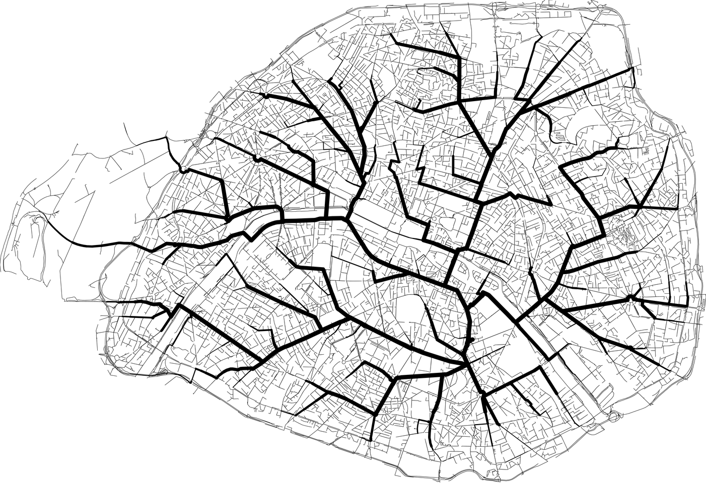
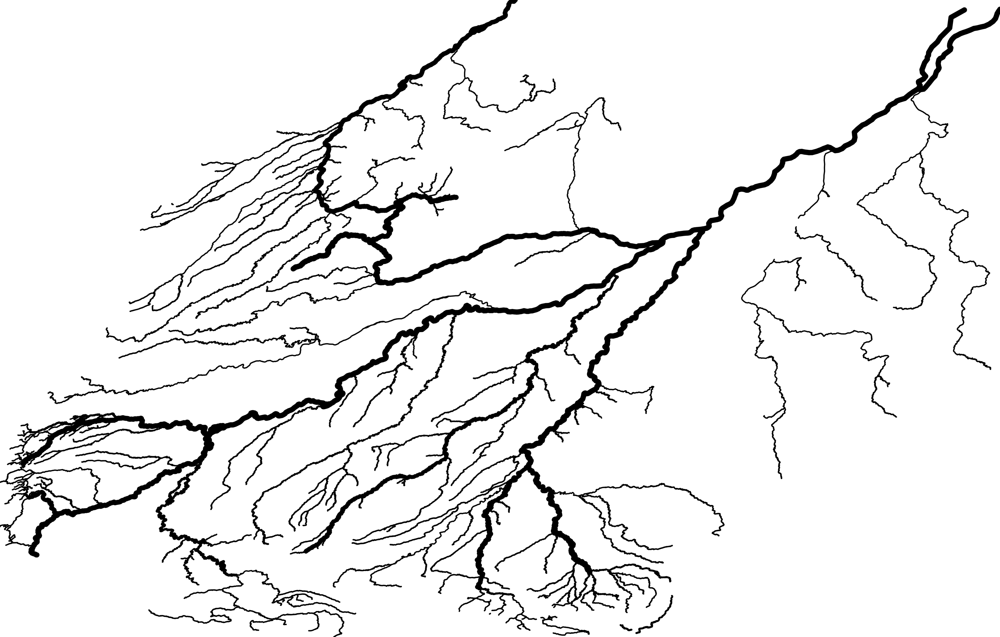
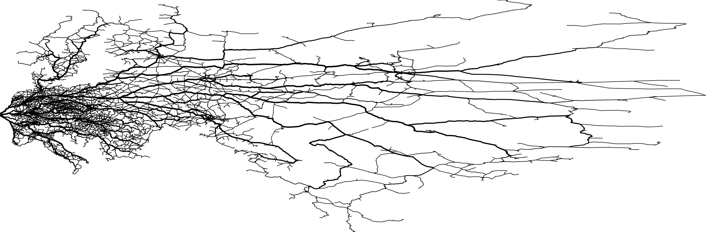
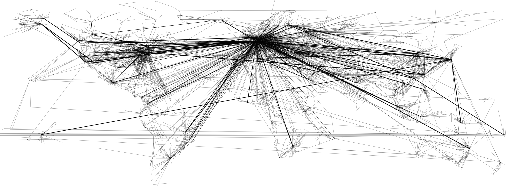
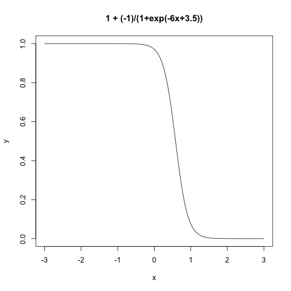
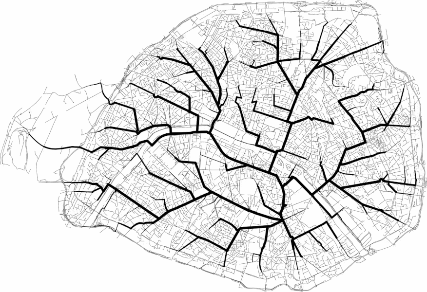

# Dijkstra Cartography


- All roads lead to my home (at least in Paris) [[HD 14016x9599 / 7.3MB](./results/HD/paris.png)]
 
- The Amazon river / Rio Amazonas with all its tributaries [[HD 11962x7625 / 3MB](./results/HD/amazon.png)]

- Eastern European Railway (from Paris) [[HD 29255x9624 / 10.8MB](./results/HD/railway.png)]

- World Flights (from Paris) [[HD 17900x6600 / 17.72MB](./results/HD/flights.png)]


## Introduction

I was fascinated by the project ["Roads to Rome"](http://roadstorome.moovellab.com/) by Moovellab but sad that it isn't opensource. Helped by [this project](https://github.com/Tristramg/roads-from-nd) (thanks @tristramg ) I started to build my own map.

I did not have any GIS background but it was very interesting to discover what we can do with. The code isn't very good (I'm not a *C++ guru*).

The project is named "*Dijkstra Cartography*" but sometimes [BFS algorithm](https://en.wikipedia.org/wiki/Breadth-first_search) is better (if all the edges have the same weight).

This code can be useful for cartographer, as I found a lot of errors for the river Amazon ([see here](./results/errors.png)) or.. to have your own poster 😉.

## Extract

You may not want to use the [planet.osm](http://wiki.openstreetmap.org/wiki/Planet.osm) file (644GB - all the openstreetmap data in one file).
Choose the right file [here](https://download.geofabrik.de) and extract what you really need with openstreetmap's tools : osmconvert, osmfilter, osmosis, osmium...

One interesting way is that you can extract all the data within a polygon with osmconvert, and [here are some cities polygons](https://github.com/JamesChevalier/cities).

## Routing

| Map        | Routing system used                                      |
| -----------|----------------------------------------------------------|
| Paris      | [Graphhopper](https://github.com/graphhopper/graphhopper) - "Dijkstrabi" |
| Amazon     | Dijkstra's algorithm                                     |
| Railway    | [OSRM](https://github.com/Project-OSRM/osrm-backend)     |
| Flights    | Dijkstra's algorithm  

The first thing to do is to gather the statistics of usage of all paths :
for each location, execute the routing algorithm you chose to your root location (your home for example).
Merge all and sort the data by the most used path.


## Projections

| Map        | Projection                                    |
| -----------|-----------------------------------------------|
| Paris      | Lambert 93-I EPSG:27571                       |
| Amazon     | ESRI:102032 (South America Equidistant Conic) |
| Railway    | Mercator                                      |
| Flights    | WSG84                                         |

You can follow [this guide](http://www.georeference.org/doc/guide_to_selecting_map_projections.htm), search [SpatialReference](http://spatialreference.org/ref/) or [ESPG.io](http://epsg.io/).


## Drawing
Considering the data is sorted and well projected.

The width and height of the image are defined like this :

```
width = (maxX-minX)/scale;
height = (maxY-minY)/scale;
```

To draw these paths, I used this function (plotted using R) :


as it gives me a percent (between [0;1] here) of how the line width must be  important. Also I can accentuate the decreasing by modifying parameters inside *exp()*.

I used cairo and I was really suprised that I can understand these map without using any shapefile.


## Details for each map

- [Paris](./paris/)
- [Amazon](./amazon/)
- [Railway](./railway/)
- [Flights](./flights/)

## Bonus



## License

[See here](./license.md).
